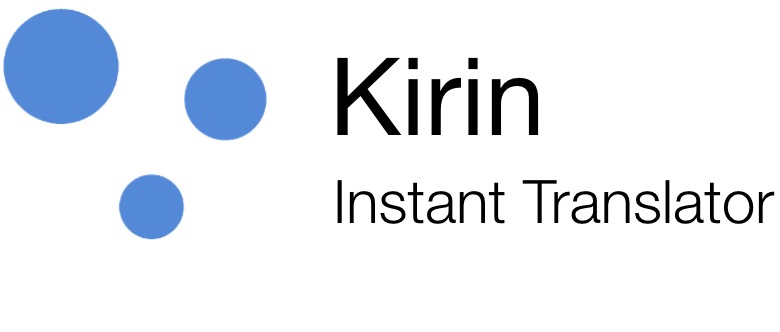

Having words wished to be translated by jumping to other translator apps to do the job is always tedious activity. 
Kirin is born to eliminate these routines by you can do any language translation in any apps you are in now.

## Features
* Using same engine as **Google Translate does**. So the quality result is reliable.
* Supporting 110 languages. List can be found [here](https://cloud.google.com/translate/docs/languages).
* Overlay floating button so you can show up the translator service in wherever apps you wish to.
* Extra instant translation by just selecting text and select **Kirin** in context menu editor.
* **Google Translate** entry for displaying translated result in detail.

## Demo

## License
    MIT License
    
    Copyright (c) 2020 ErickSumargo
    
    Permission is hereby granted, free of charge, to any person obtaining a copy
    of this software and associated documentation files (the "Software"), to deal
    in the Software without restriction, including without limitation the rights
    to use, copy, modify, merge, publish, distribute, sublicense, and/or sell
    copies of the Software, and to permit persons to whom the Software is
    furnished to do so, subject to the following conditions:
    
    The above copyright notice and this permission notice shall be included in all
    copies or substantial portions of the Software.
    
    THE SOFTWARE IS PROVIDED "AS IS", WITHOUT WARRANTY OF ANY KIND, EXPRESS OR
    IMPLIED, INCLUDING BUT NOT LIMITED TO THE WARRANTIES OF MERCHANTABILITY,
    FITNESS FOR A PARTICULAR PURPOSE AND NONINFRINGEMENT. IN NO EVENT SHALL THE
    AUTHORS OR COPYRIGHT HOLDERS BE LIABLE FOR ANY CLAIM, DAMAGES OR OTHER
    LIABILITY, WHETHER IN AN ACTION OF CONTRACT, TORT OR OTHERWISE, ARISING FROM,
    OUT OF OR IN CONNECTION WITH THE SOFTWARE OR THE USE OR OTHER DEALINGS IN THE
    SOFTWARE.
